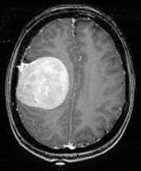
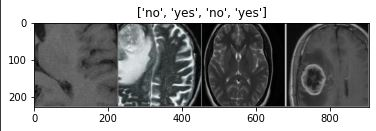

# Brain_Tumor_Detection_PyTorch

Brain_Tumor_Detection repository

##  Online Execution on Google Colab

## Guideline to Run the Code:
____________________________________
### Execution on Google Colab

The code can be executed in Google Colab by following the guideline below:
1. Click on the 'Brain_Tumor_Detection': https://colab.research.google.com/drive/13tMgvZzp7kK0ZZb5DE1UnJJBy1HQ5SId#scrollTo=WUFUI98rZ904 and open it in Colab and make a copy in your account
2. Download the zip named 'val.zip' folder: https://drive.google.com/file/d/1Ao0-3mUFBD85IJh0mpNvAyAoNhgDhXuQ/view?usp=sharing
3. Create a folder and subfolder named **kaggle_dataset/detect/** in the root of your Google Drive, and upload all the files previously downloaded.
4. Click on "Run all" under the Runtime menu or use the Ctrl+F9 shortcut.
5. At the begining of the execution the code requires to access the required files by mounting your Google Drive. Click on the provided link, copy the generated code by Google, and paste it in the next line within the given box.
6. The program would keep running showing a detection progress bar untill reaching 100% and ends by generating four images verification

